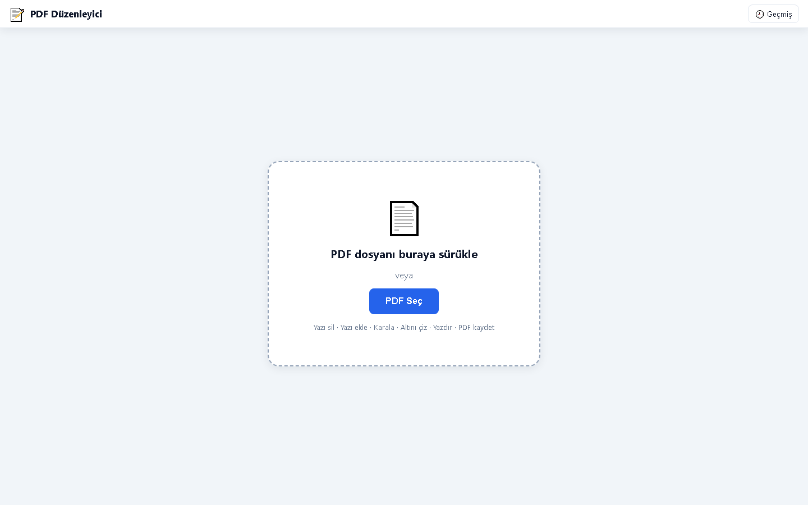

# 📝 PDF Düzenleyici

Tarayıcıda çalışan, kurulum gerektirmeyen ücretsiz bir PDF düzenleme aracı. PDF yükle; yazı sil, yazı ekle, karala, fosforlu işaretle, altını çiz, resim/PDF ekle, yazdır ve düzenlenmiş halini yeni bir PDF olarak kaydet. Tüm işlemler tamamen tarayıcıda gerçekleşir — **dosyalarınız hiçbir sunucuya yüklenmez.**

## 🌐 Canlı Demo

**https://pdf-duzenleyici-lime.vercel.app/**

## 📸 Ekran Görüntüleri

| Ana Ekran |
|---|
|  |

## ✨ Özellikler

- 📄 **PDF yükleme** — sürükle-bırak veya dosya seçici ile
- 🅰️ **Yazı ekleme** — serbest konumlu, taşınabilir yazı kutuları
- 🆕 **Zengin metin biçimlendirme** — yazı tipi seçimi (Segoe UI, Arial, Times New Roman, Georgia, Courier New, Verdana, Comic Sans MS), kalın/italik/altı çizili, renk; bir kelime/cümleyi fareyle seçip **A- / A+** ile kutunun geri kalanını etkilemeden sadece o kısmı büyütüp küçültebilirsiniz — bold/italik/altı çizili de aynı şekilde sadece seçili metne uygulanabilir
- 🆕 **Değişiklik günlüğü paneli (🧾 Değişiklikler)** — o an açık belgede yapılan her işlemi (hangi yazı eklendi, hangi sayfada, ne zaman) listeler; her satırda tek tek geri alınabilen bir Sil butonu ve o değişikliğe/kutuya doğrudan atlayıp düzenlemeye başlatan bir "✏️ Git" butonu var
- 🧽 **Yazı silme** — beyaz ile kapatma veya kağıdın kendi rengini algılayıp onunla kapatma ("Kağıt Rengi" modu)
- ✏️ **Karalama / kalem** — serbest çizim, 10 hazır renk + özel renk seçici, ayarlanabilir kalınlık
- 🖍️ **Fosforlu işaretleme** — yarı saydam vurgulama
- 〰️ **Altını çizme**
- 🖼️ **Resim / PDF ekleme** — resmi sayfanın üzerine koyup taşıyabilir ve boyutlandırabilirsiniz; PDF eklerken "üst üste koy" (ilk sayfa resim olarak) veya "alt alta ekle" (tüm sayfalar belgenin sonuna) seçenekleri
- 🆕 ✂️ **Alan seç (taşı / kopyala)** — sayfadan dikdörtgen bir bölgeyi seçip taşınabilir/boyutlandırılabilir bir parçaya dönüştürür. **Taşı** modunda seçtiğin alanın eski yeri kağıt rengiyle otomatik kapatılır (kes-yapıştır), **Kopyala** modunda orijinali yerinde kalır (kopyala-yapıştır)
- 🆕 🔄 **Döndürme ve otomatik eğim düzeltme** — eklenen resim/PDF ya da taşınan alan, açı slider'ı ile döndürülebilir; eğri taranmış belgelerde metin eğimi otomatik tespit edilip düzeltilmeye çalışılır (slider'dan ince ayar yapabilirsiniz)
- ↩️ **Geri alma** — sayfa başına 25 adıma kadar (Ctrl+Z)
- 🖨️ **Yazdırma**
- 💾 **PDF olarak kaydetme** — düzenlenmiş belge pdf-lib ile yeniden oluşturulur; kısmi büyütme/küçültme gibi zengin metin biçimleri de kaydedilen PDF'e doğru şekilde işlenir
- 🕘 **Geçmiş paneli** — kaydedilen PDF'ler IndexedDB'de tarayıcıda saklanır; tekrar indirilebilir veya silinebilir
- 🔒 **Gizlilik** — tüm düzenleme işlemleri tarayıcıda (istemci tarafında) yapılır, kod hiçbir dosyayı sunucuya göndermez. *(Gerçek gizlilik yalnızca projeyi **yerel çalıştırırsanız** garanti edilir. Canlı Vercel sürümü üçüncü taraf bir serviste barındırıldığı için — örneğin servisin ele geçirilmesi gibi durumlarda — güvenliği garanti edemem ve bu konuda sorumluluk kabul etmiyorum. Hassas belgeler için lütfen yerel kurulumu kullanın.)*

## 🛠️ Kullanılan Teknolojiler

| Teknoloji | Amaç |
|---|---|
| **HTML / CSS / Vanilla JavaScript** | Arayüz ve uygulama mantığı (framework yok) |
| **[pdf.js](https://mozilla.github.io/pdf.js/) 3.11** | PDF sayfalarını canvas'a çizme (görüntüleme) |
| **[pdf-lib](https://pdf-lib.js.org/) 1.17** | Düzenlenmiş PDF'i yeniden oluşturma ve kaydetme |
| **Canvas API** | Çizim katmanı (karalama, silme, işaretleme, altı çizme) |
| **IndexedDB** | Kaydedilen PDF'lerin tarayıcıda saklanması (geçmiş) |
| **Vercel** | Statik hosting / yayınlama |

## 🚀 Kurulum ve Çalıştırma

Derleme adımı yoktur; statik bir sitedir.

```bash
# Depoyu klonla
git clone https://github.com/fkfkg/pdf-duzenleyici.git
cd pdf-duzenleyici

# Herhangi bir statik sunucu ile çalıştır, örneğin:
npx serve .
# veya
python -m http.server 8000
```

Ardından tarayıcıda `http://localhost:8000` (veya sunucunun verdiği adres) açılır. `index.html` dosyasını doğrudan çift tıklayarak da açabilirsiniz; ancak bazı tarayıcılarda `file://` üzerinden IndexedDB kısıtlı olabileceği için yerel sunucu önerilir.

> Not: pdf.js ve pdf-lib CDN üzerinden yüklendiği için ilk açılışta internet bağlantısı gerekir.

## 🤖 Ben Ne Yaptım, AI Ne Yaptı?

Bu proje **Claude (Anthropic)** yapay zekâsı ile birlikte "vibe coding" yaklaşımıyla geliştirildi:

- **Ben (geliştirici):** Ürün fikri, ihtiyaç tanımı ve yönlendirme benden geldi — hangi araçların olacağı (yazı silme, kağıt rengi algılama, resim/CV fotoğrafı ekleme, geçmiş paneli vb.), arayüzün Türkçe olması, test etme, hataları bulup AI'a bildirme, Vercel'de yayınlama ve GitHub süreci.
- **AI (Claude):** Kod yazımının büyük kısmı — pdf.js/pdf-lib entegrasyonu, canvas çizim katmanı, geri alma sistemi, IndexedDB geçmiş deposu, arayüz tasarımı ve bu README.

## 🐞 Bilinen Hatalar / Eksikler

- PDF'teki **mevcut yazılar gerçek anlamda silinmez/düzenlenmez**; "Yazı Sil" aracı yazının üstünü beyaz veya kağıt rengiyle kapatır (raster yaklaşım).
- Kaydedilen PDF'te sayfalar **görüntü (JPEG) olarak** yeniden oluşturulur; bu yüzden çıktıda metin seçilemez/aranamaz ve dosya boyutu artabilir.
- Çok büyük veya çok sayfalı PDF'lerde yükleme ve kaydetme yavaşlayabilir (tüm sayfalar 2x ölçekle çizilir).
- Mobil/dokunmatik deneyim tam optimize değil; en iyi deneyim masaüstü tarayıcıda.
- Şifre korumalı PDF'ler açılamaz.
- Geçmiş tarayıcının IndexedDB'sinde tutulduğu için tarayıcı verileri temizlenince kaybolur.

## 📄 Lisans

Bu proje serbestçe kullanılabilir ve geliştirilebilir.
